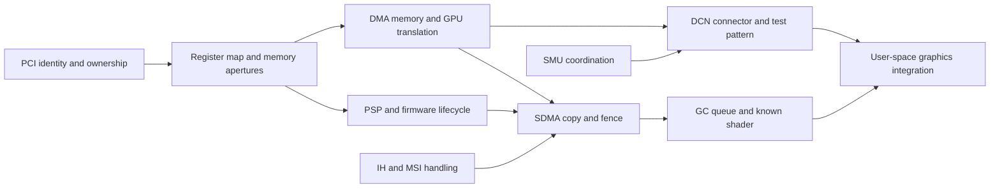

# Cezanne hardware map

Scope: initial `1002:1638:c9` target. This is a source study and a proposed
implementation boundary, not a register programming recipe. The
[host baseline](hardware-baseline.md) supplies OS observations only.

## Identity and evidence

Linux v6.12 matches `1002:1638` to `CHIP_RENOIR | AMD_IS_APU`. That software
family includes this target; it does not imply that every Renoir firmware or
register sequence applies to Cezanne. Refer to the pinned
[AMDGPU PCI table](https://github.com/torvalds/linux/blob/v6.12/drivers/gpu/drm/amd/amdgpu/amdgpu_drv.c).

Expected study paths are GFX9/Vega graphics, GMC9 memory management, SDMA4,
PSP12 handling, SMU12 APU power management, and DCN2.1 display. These handler
names are not measurements of the host's IP revisions. Linux selects handlers
using IP version data and validates discovery structures; verify the actual
versions before deriving any register map. See
[IP discovery and dispatch](https://github.com/torvalds/linux/blob/v6.12/drivers/gpu/drm/amd/amdgpu/amdgpu_discovery.c).

AMDGPU separates IP lifecycle operations, GPU virtual address spaces, interrupts,
firmware security, power, display and submission. APUs share system components;
their VRAM domain represents firmware-reserved system RAM. The new macOS adapter
must replace Linux OS facilities rather than reproduce DRM/TTM interfaces.
[AMDGPU architecture](https://docs.kernel.org/gpu/amdgpu/driver-core.html)
is the conceptual reference, not a macOS integration specification.

## Blocks and responsibilities

| Block / access path | Hardware-core responsibility | Adapter responsibility and unresolved evidence | Pinned reference |
| --- | --- | --- | --- |
| SoC / NBIO; PCI apertures, MMIO and indexed registers | IP base/offset tables, serialized indirect access, doorbell layout and reset sequences | Claim PCI device only in an experimental boot; map correct BARs; establish physical vs GPU addresses. Registry aperture sizes do not establish BAR function. | [soc15.c](https://github.com/torvalds/linux/blob/v6.12/drivers/gpu/drm/amd/amdgpu/soc15.c) |
| GMC, GFXHUB, MMHUB, GART | Page-table format, VM context programming, TLB invalidation, fault decoding | Allocate/pin DMA memory, retain it through completion, supply GPU-visible addresses and cache synchronization. Verify UMA carveout, DMA translation and address widths. | [gmc_v9_0.c](https://github.com/torvalds/linux/blob/v6.12/drivers/gpu/drm/amd/amdgpu/gmc_v9_0.c), [gfxhub_v1_0.c](https://github.com/torvalds/linux/blob/v6.12/drivers/gpu/drm/amd/amdgpu/gfxhub_v1_0.c), [mmhub_v1_0.c](https://github.com/torvalds/linux/blob/v6.12/drivers/gpu/drm/amd/amdgpu/mmhub_v1_0.c) |
| PSP / MP0; host command ring and mailbox | Firmware command encoding, completion/status checks, trusted-memory requirements | Stage approved firmware in pinned memory, enforce bounded waits and cleanup. Exact bootloader state and accepted images remain unobserved. | [psp_v12_0.c](https://github.com/torvalds/linux/blob/v6.12/drivers/gpu/drm/amd/amdgpu/psp_v12_0.c), [amdgpu_psp.c](https://github.com/torvalds/linux/blob/v6.12/drivers/gpu/drm/amd/amdgpu/amdgpu_psp.c) |
| IH / OSSSYS; interrupt rings | Decode source/client IDs, ring entries, acknowledgements and overflow | Route MSI, schedule bounded deferred handling, synchronize teardown. The baseline's `IOPCIMSIMode=true` does not verify a new driver's interrupt path. | [vega10_ih.c](https://github.com/torvalds/linux/blob/v6.12/drivers/gpu/drm/amd/amdgpu/vega10_ih.c) |
| SDMA; ring and indirect buffers | Copy packets, ring pointers, fence writes, traps and engine lifecycle | Own pinned buffers and fences, apply cache ordering, handle timeout/reset. First hardware execution experiment should be a guarded copy. | [sdma_v4_0.c](https://github.com/torvalds/linux/blob/v6.12/drivers/gpu/drm/amd/amdgpu/sdma_v4_0.c) |
| GC; CP ME/PFP/CE/MEC, RLC, graphics/compute queues | PM4 packets, queue descriptors, KIQ operations, dispatch state and shader addressing | Validate command buffers and resource lifetimes; isolate clients; establish fence semantics. First shader is a fixed, audited binary. | [gfx_v9_0.c](https://github.com/torvalds/linux/blob/v6.12/drivers/gpu/drm/amd/amdgpu/gfx_v9_0.c) |
| DCN; HUBP/HUBBUB, DPP, MPC, OPP, timing generators, encoders, AUX/I²C | Surface layout, pipe configuration, link/timing sequences, vblank and flips | Parse board/firmware connector information; expose modes and framebuffer lifecycle; verify routing and bandwidth before scanout. | [dcn21_resource.c](https://github.com/torvalds/linux/blob/v6.12/drivers/gpu/drm/amd/display/dc/resource/dcn21/dcn21_resource.c) |
| SMU / MP1; firmware messages and tables | Clock/power policy requests, gating and telemetry encoding | Coordinate macOS power transitions and display needs. Shared APU power/reset domains require whole-system recovery evidence. | [renoir_ppt.c](https://github.com/torvalds/linux/blob/v6.12/drivers/gpu/drm/amd/pm/swsmu/smu12/renoir_ppt.c) |

Indexed register reads can require writing an index register. They therefore
fall outside the current read-only host constraint. Do not translate this table
into live MMIO probes while the reference driver owns the device.

## Firmware and shader boundaries

Upstream declares `green_sardine` CE/PFP/ME/MEC/MEC2/RLC, SDMA, and PSP ASD/TA
images. Firmware selection also depends on IP version and APU flags: GC 9.3.0
and SDMA 4.1.2 distinguish Renoir from the Green Sardine path; MP0 12.0.1 selects
Green Sardine. These are candidate selection rules, not a verified firmware
manifest for this host. Record required/optional images, provenance, hashes,
header bounds and versions before loading. See
[amdgpu_ucode.c](https://github.com/torvalds/linux/blob/v6.12/drivers/gpu/drm/amd/amdgpu/amdgpu_ucode.c)
and the block references above.

AMD microcode is permitted. Host-side header/size checks and cryptographic
signature acceptance by the security processor are separate requirements;
checksums do not replace signed-image validation. Never assume modified images
will be accepted. PSP loading success, rejected-image behavior, and bounded
failure handling need verification on an experimental boot. No firmware was
downloaded, extracted, redistributed, or loaded in this milestone.

Shader compilation belongs to a separate subsystem. The
[AMD Vega ISA](https://www.amd.com/content/dam/amd/en/documents/radeon-tech-docs/instruction-set-architectures/vega-shader-instruction-set-architecture.pdf)
describes instructions, registers, wave execution and memory operations; it
does not specify Metal's compilation ABI. The
[LLVM AMDGPU backend](https://llvm.org/docs/AMDGPUUsage.html) lists `gfx90c` as
a Cezanne target. A backend targeting that ISA is a candidate, not proof that
its code-object ABI or resource descriptors match our queues or Metal.

## Proposed bring-up dependencies

This is a project dependency hypothesis; exact IP initialization order must be
resolved against target source paths and recorded hardware evidence.

## Next experiments

| Experiment | Scope | Success criterion |
| --- | --- | --- |
| Offline target inventory | Allowed now: trace pinned upstream dispatch and firmware selection | Produce an IP/firmware manifest with source symbols, version checks, and each unresolved host value explicitly marked |
| Board connector study | Allowed now: inspect existing registry/EDID and firmware documentation | Explain display-to-framebuffer associations without claiming unobserved cable routing or using register access |
| PCI ownership and diagnostics | Deferred to experimental boot | Own driver matches only 1002:1638:c9, reports verified BARs/IP identity, unloads/reboots cleanly, never competes with reference ownership |
| Memory, firmware, interrupts, copy | Deferred to experimental boot | Signed images accepted; guarded patterned copy matches byte-for-byte; fence completes within a deadline; interrupt counts and cleanup explain completion; injected failures recover |
| First display and shader | Deferred to experimental boot | One specified connector/mode shows stable known pixels; known shader returns CPU-reference output with guards intact and bounded completion |

Use upstream code as a reference with per-file license review before any reuse.
No Linux code or firmware is incorporated in the implementation in this milestone.
