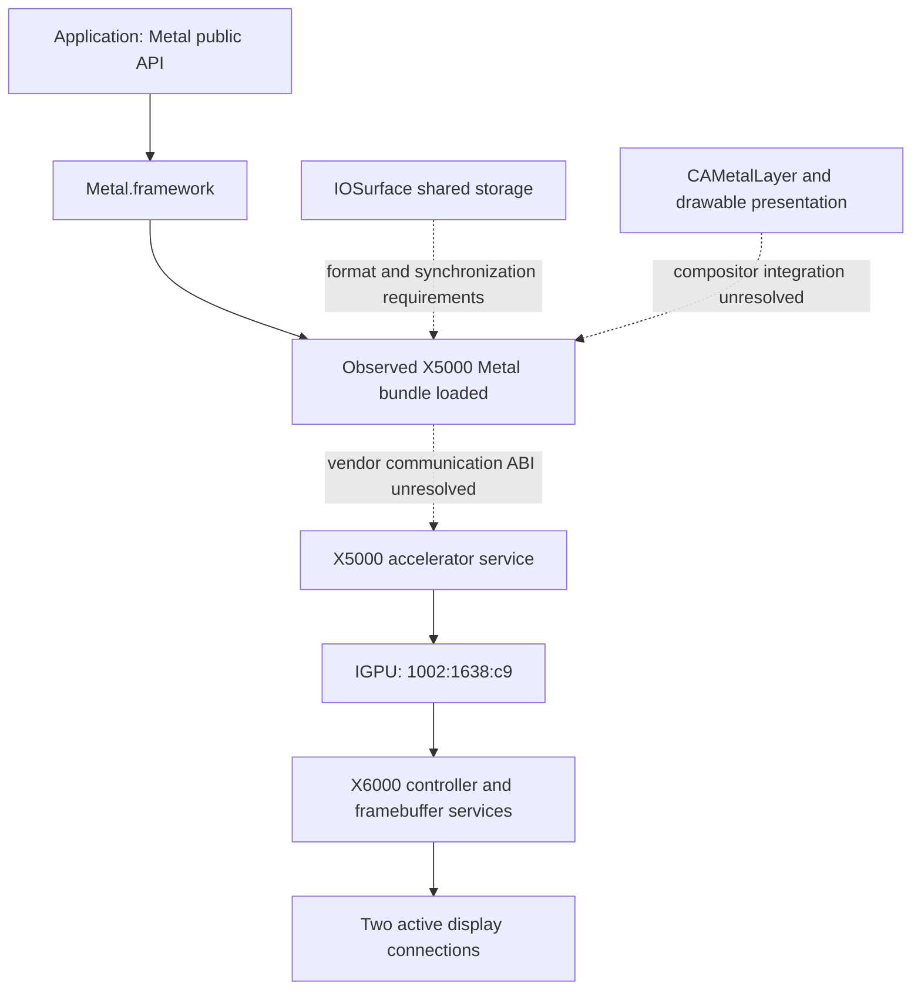

# Tahoe graphics contract study

Target OS: macOS 26.4.1, build 25E253, x86_64. Observations below apply to this
boot's existing Lilu/NootedRed/Apple AMD stack. Public API contracts, observed
metadata, and unresolved vendor interfaces are separate evidence categories.
No independent Metal driver is implemented.

## Observed discovery path

The [baseline](hardware-baseline.md) has a PCI `IGPU` service with
`AMDRadeonX5000_AMDVega10GraphicsAccelerator` and X6000 framebuffer/controller
services. Accelerator properties include:

| Property | Captured value |
| --- | --- |
| CFBundleIdentifier | com.apple.kext.AMDRadeonX5000 |
| MetalPluginName | AMDRadeonX5000MTLDriver |
| MetalPluginClassName | AMDMTLGFX9Device |
| MetalStatisticsName | GFX9Statistics |
| IOGLBundleName | AMDRadeonX5000GLDriver |
| IOAccelRevision | 2 |
| IOAccelDisplayPipeCapabilities | DisplayPipeSupported and TransactionsSupported true |

The public `MTLCopyAllDevices` inventory returns one device named
`AMD Radeon RX Renoir Graphics`, registry ID `4294968382` (`0x10000043e`).
That ID matches the accelerator in the capture. During enumeration, dyld
reports `/System/Library/Extensions/AMDRadeonX5000MTLDriver.bundle/Contents/MacOS/AMDRadeonX5000MTLDriver`
as loaded, together with Metal, IOAccelerator, and IOSurface frameworks.
Inventory stdout/stderr and exit status are in `out/independent-20261002`.
An ID is a within-boot correlation key, not a stable device identifier.

Inference: these accelerator properties participate in vendor-plugin discovery.
We have observed correlation and a loaded bundle, not the loader's required
metadata, validation policy, factory ABI, or complete negotiation. Publishing
similar properties alone is not evidence that a new plugin will load.

The installed X5000 kext Info.plist's Vega10 personality uses
`IOProviderClass=IOPCIDevice`, `IOMatchCategory=IOAccelerator`,
`IOPropertyMatch={LoadAccelerator=true}`, and a discrete-Vega PCI match list
that does not include `1638`. The current patching stack is loaded. Therefore
the installed plist is insufficient to explain live matching; the mechanism
and modified behavior remain unresolved. Installed bundle metadata was inspected
read-only; no AMD binary code was copied or modified.

Edges involving the vendor communication path are study hypotheses; the registry
does not provide a call trace from Metal through every service to scanout.

## Public contracts and missing implementation interfaces

| Boundary | Source-backed contract / local observation | What the independent stack still needs |
| --- | --- | --- |
| Framebuffer | Apple describes IOFramebuffer as providing simple framebuffer operation, insufficient for the full macOS experience. Host has framebuffer user clients and two display connections. | Modes, EDID, cursor, vblank/flip, hotplug, power, and compositor coordination. A test pattern establishes only display bring-up. [IOFramebuffer](https://developer.apple.com/documentation/kernel/ioframebuffer?language=objc) |
| Device discovery | `MTLCopyAllDevices()` enumerates Metal devices; `MTLDevice.registryID` provides an IOKit correlation key. Host ID matches an accelerator and its named plugin loads. | Loader metadata, bundle lookup policy, signing/entitlements, factory symbols, runtime object ABI and capability negotiation. No public vendor-driver registration SDK was established by this study. [Enumeration](https://developer.apple.com/documentation/metal/mtlcopyalldevices()), [registryID](https://developer.apple.com/documentation/metal/mtldevice/registryid) |
| User-client communication | IOKit provides service matching/opening, scalar/structure external calls, memory mapping, asynchronous notifications and lifetime management. Registry contains device, queue, shared, surface and display-pipe client classes. | Connection types, selectors, struct versions/sizes, shared-memory layouts, resource handles, fences, validation and process isolation. Their names do not define the ABI. [IOKit fundamentals](https://developer.apple.com/library/archive/documentation/DeviceDrivers/Conceptual/IOKitFundamentals/Features/Features.html), [IOConnectCallMethod](https://developer.apple.com/documentation/iokit/1514240-ioconnectcallmethod) |
| Shared surfaces | IOSurface provides cross-process framebuffer/texture storage; Metal exposes texture creation using an IOSurface plane. | Accepted formats/planes, row pitch, tiling/modifiers, allocation ownership, CPU/GPU cache ordering, fence transfer, purge/reclaim, lifetime and compositor compatibility. Storage sharing alone does not establish synchronization. [IOSurface](https://developer.apple.com/documentation/iosurface), [Metal IOSurface texture](https://developer.apple.com/documentation/metal/mtldevice/maketexture(descriptor:iosurface:plane:)) |
| Shader compilation | Metal can create a library by compiling MSL source, and has APIs for precompiled libraries and pipelines. The SDK exposes `newLibraryWithSource:options:error:` and `newLibraryWithData:error:`. | MSL/library frontend contract, intermediate representation access, pipeline metadata, resource layouts, gfx90c lowering, instruction selection and linkage. Availability of an LLVM target does not supply a Metal vendor backend. [Runtime compilation](https://developer.apple.com/documentation/metal/mtldevice/makelibrary(source:options:)) |
| Presentation | CAMetalLayer supplies drawables whose textures are rendered into and presented through command buffers. | Drawable ownership, completion, backpressure, IOSurface exchange, display pipe handoff, timing, color/rotation, WindowServer composition and recovery. [CAMetalLayer](https://developer.apple.com/documentation/quartzcore/cametallayer), [command-buffer presentation](https://developer.apple.com/documentation/metal/mtlcommandbuffer/present(_:)) |

Public API semantics were cross-checked against installed macOS SDK 26.5
headers (`Metal/MTLDevice.h`, `IOKit/IOKitLib.h`, `QuartzCore/CAMetalLayer.h`).
The SDK is newer than the host runtime; declarations do not prove that private
Tahoe driver interfaces are public or stable. Apple documentation Markdown was
retrieved locally where the web viewer could not render JavaScript pages.

## Proposed architecture

The hardware core owns packet generation, firmware, GPU memory translation,
fences, display control and recovery. The IOKit adapter owns PCI/DMA/interrupt
resources, service publication, power/lifetime coordination and a checked,
versioned user-client protocol. The user-space graphics layer owns API objects,
resources, command encoding, IOSurface interoperability and presentation.
The shader backend is independently tested before hardware dispatch.

The project can design its own diagnostic/submission protocol for early hardware
tests. That protocol is not automatically compatible with Metal or WindowServer.
Metal vendor discovery and its factory/runtime ABI are an early feasibility
gate. General Apple frameworks can remain dependencies; invoking Apple's AMD
Metal plugin in a test does not satisfy the independent-driver milestone.

## Next experiments and measurable gates

| Experiment | Permission boundary | Success criterion |
| --- | --- | --- |
| Repeat discovery correlation | Read-only; existing tools | Across fresh captures, every public Metal device ID resolves to the expected accelerator; record plugin properties and loaded image paths, preserving denied/empty results |
| Static vendor-loader study | Read-only installed metadata, SDK/API definitions and permitted symbol inspection | Identify candidate factory/registration interface, policy checks, OS-version dependencies, and the minimum required MTLDevice contract; each claim has evidence or is explicitly unknown |
| User-client contract inventory | Read-only public/source definitions; no selector guessing against live drivers | Versioned table of connection types, calls, input/output sizes, mappings, notifications and cleanup rules; unresolved entries prevent implementation claims |
| Offline shader boundary study | Local compilation only; no queues/dispatch | Record compiler inputs/outputs and errors for one fixed kernel; determine whether a permitted frontend exposes enough information for an independent gfx90c backend |
| Synthetic independent discovery | Deferred to experimental environment; custom services/plugin installation | An application enumerates our device and instantiates our plugin without any Apple AMD bundle loaded; repeatable logs explain discovery and failures |
| Resource and presentation tests | Deferred until own queues and known shader work | Guarded rendering matches a CPU reference; two-process IOSurface exchange preserves pixels and synchronization; repeated drawable present/resize cycles complete without stalls, leaks or reference AMD dependencies |
| Desktop composition | Deferred until presentation works | WindowServer composes desktop workloads with correct pixels/timing; logged recovery and sleep/wake restore service without reboot or corruption |

No custom user clients were opened and no selector calls, shader compilation,
resource allocation, rendering, or presentation tests were executed in this
milestone. Those entries are the next investigations, not passed acceptance tests.
