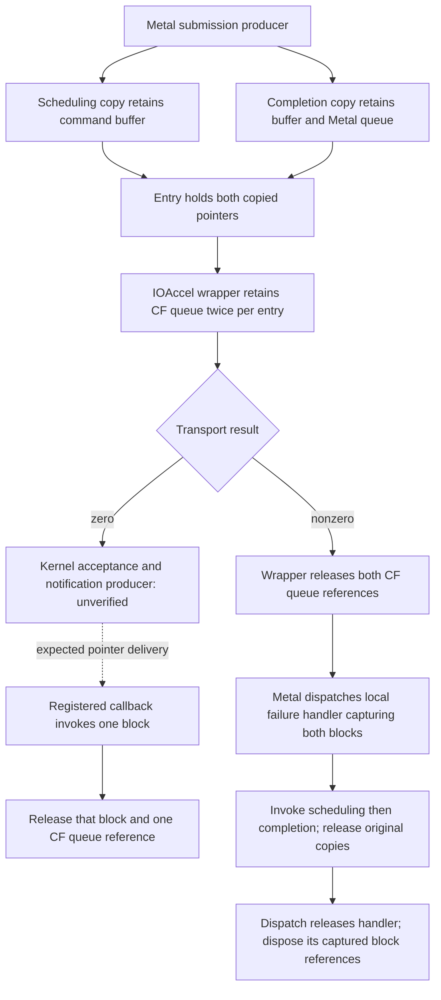

# IOAccel submission block producers and ownership

Metal's inspected submission producer creates **two distinct copied blocks per
entry**, for scheduling and completion. This gives the earlier two queue retains
a concrete producer-side explanation. On transport failure, IOAccelerator rolls
back its CF queue retains and Metal dispatches a local handler that invokes and
releases both copied blocks. On transport success, the inspected producer leaves
both copies outstanding for notification delivery. **The kernel's acceptance,
message production and callback cardinality remain unverified.**

This is a static ownership graph for the inspected paths, not an implemented
protocol or a successful queue experiment. Read the
[notification/lifecycle study](ioaccel-lifecycle.md) for registration, partial
payload consumption and asynchronous notification-port cancellation.

## Evidence and scope

Host reconfirmed on 2026-10-02: macOS 26.4.1 build 25E253, x86_64, reported
Ryzen 5 5600GT, PCI `1002:1638:c9`. SDK headers are from 26.5. The unchanged
public metadata child was rebuilt with `-g -O0 -Wall -Wextra -Werror`, then stopped
at `probe.m:48` after enumeration. LLDB read Metal instructions and bounded
descriptor/helper data. There were no target expressions, manual private calls,
queue creation or GPU submissions. Enumeration may initialize the existing stack.

Ignored `out/ioaccel-block-ownership/` retains command argv, UTC time, stdout,
stderr and exit status. `metal-submit`, `descriptors-verified`,
`metal-consumers-verified`, `metal-callers` and `metal-submit-available` contain
the relevant disassembly. `experiment-index.json` indexes captures and digests.
The IOAccelerator submission and callback evidence is reused from
`out/ioaccel-lifecycle-detail/documented-lifecycle.stdout`.

Two unrestricted all-image regex searches exceeded their 45-second timeout;
partial output is preserved, including a completed descriptor read in one batch.
Restricting symbol searches to `Metal` completed. Two guessed subclass-qualified
consumer names were absent and exited 1; the module index located the methods
under `_MTLCommandBuffer` and `_MTLCommandQueue`. These failures do not establish
absent functionality. Enumeration's locale warning remains in the raw captures.

Primary references read on 2026-10-02:

- [Clang Apple Blocks ABI](https://clang.llvm.org/docs/Block-ABI-Apple.html)
  defines the literal, descriptor and optional copy/dispose helper layout, and
  object/block capture flags. It is a compiler/runtime reference, not an IOAccel
  kernel contract.
- [Clang Blocks language specification](https://clang.llvm.org/docs/BlockLanguageSpec.html)
  defines paired copy/release operations and retained Objective-C captures.
- [Apple dispatch queue guidance](https://developer.apple.com/library/archive/documentation/General/Conceptual/ConcurrencyProgrammingGuide/OperationQueues/OperationQueues.html)
  describes copying queued blocks and releasing them after execution.
  Installed SDK `dispatch/queue.h`, lines 207–239, explicitly assigns that
  copy/release work to `dispatch_async`; SDK `Block.h`, lines 28–34, describes
  heap copying/reference increments and last-reference release.

Saved web documents and SDK headers have local SHA-256 digests. An initial
GitHub HTML request for the dispatch header returned 503; the raw upstream header
was collected successfully as supplementary evidence. Neither that mutable
upstream source nor SDK version 26.5 is asserted to match the installed runtime.

## Producer fields and captured owners

`-[MTLIOAccelCommandQueue submitCommandBuffers:count:]` builds a stack submission
structure, stores the count at header offset 4, and fills entries at offset 8
with stride 24. The table describes writes on its positive-count path; it is
not a complete wire-format definition.

| Entry-relative byte offset | Observed producer write |
| --- | --- |
| 0 | 32-bit `_shmemID` from the object at command-buffer storage offset `0x20` |
| 4 | 32-bit `_shmemID` from the object at storage offset `0x40` |
| 8 | Result of copying the scheduling block |
| 16 | Result of copying the completion block |

The producer writes the same copied pointers directly into
`MTLIOAccelCommandBuffer._scheduledCallbackBlockPtr` and
`._completedCallbackBlockPtr`. Those two stores contain no additional copy or
retain. They are aliases at these sites; all other uses, clearing and reset paths
have not been inventoried. Do not count the aliases as two more owned references
or infer that they remain safe to dereference after a callback releases its copy.
The entry is passed to `IOAccelCommandQueueSubmitCommandBuffers` via the Metal
queue's `_commandQueue` CF object.

The producer constructs stack literals with flags `0xc2000000` and invokes
`_Block_copy` twice per entry. Bounded reads of the three descriptor pointers
and their actual helper addresses establish the following captures:

| Block | Descriptor size | Captures and helper operations | Invocation |
| --- | --- | --- | --- |
| Scheduling (`..._block_invoke`) | 40 bytes | Command buffer at block offset 32; assign/dispose with flag 3 (`BLOCK_FIELD_IS_OBJECT`) | Sends `didScheduleWithStartTime:endTime:error:` to the captured buffer |
| Completion (`..._block_invoke.19`) | 48 bytes | Command buffer at 32 and Metal queue at 40; both assign/dispose with flag 3 | Sends `commandBufferDidComplete:startTime:completionTime:error:` to the captured queue, passing the buffer |
| Local failure handler (`..._block_invoke.32`) | 52 bytes | Scheduling block at 32, completion block at 40; both assign/dispose with flag 7 (`BLOCK_FIELD_IS_BLOCK`); 32-bit error at 48 | Invokes both blocks, then releases both original copied references |

Each notification block has signature `v28@?0Q8Q16I24`: void result, implicit
block argument, two unsigned 64-bit arguments and one unsigned 32-bit argument.
The local failure handler has `v8@?0`. These signatures and helper operations
support the capture and call-shape interpretation; they do not specify the
kernel's message length, validation or timestamp units.

Nonzero notification-block status is passed to `initWithIOAccelError:` before
the relevant Metal selector is sent; zero status supplies a nil error object.
This payload status is separate from the IOKit callback's transport result,
which the [registered callback](ioaccel-lifecycle.md) asserts is zero.

## Normal and error transfer paths

The **Metal Objective-C queue** captured by the completion block and the
**IOAccelerator CF queue** retained by the submission wrapper are distinct
objects. A dispatch queue used for local failure handling is a third object.



The dotted edge is a missing boundary, not a demonstrated transfer. Reusing a
raw user-process block pointer as notification data would require kernel-side
handling that has not been traced here; the kernel need not execute or understand
the block's Objective-C captures.

| Path | Static reference accounting | Assumptions and limits |
| --- | --- | --- |
| Transport returns zero | Two copied block references and two CF queue retains remain outstanding; no producer release before return. Each registered callback invokes/releases one block and drops one CF queue retain. | One valid delivery for each distinct copy would balance the inspected acquisitions. Neither delivery, order nor exclusivity is established. |
| Transport returns nonzero, positive count | IOAccel releases `2*n` CF queue references. Metal queues one local handler per entry. That handler invokes scheduling with `(0, 0, 0)`, completion with `(0, 0, mappedError)`, and releases each original copy. Dispatch's copied handler owns additional block captures, released by its dispose helper. | Balanced under normal handler execution/return and the documented dispatch/Blocks contracts. Exceptions, abrupt termination and kernel replies racing rejection are untested. The local handler does not call the registered IOAccel callback or release the CF queue again. |

The transport error mapping observed at the producer is numeric: `0x10000003`
maps to 15, `0xe00002e2` maps to 7, and other nonzero results map to 1.
No semantic names or complete `initWithIOAccelError:` translation are assigned
here. Scheduling receives zero status even in this local failure path; that
local scheduling notification cannot establish successful GPU scheduling.

The failure-handler copy helper copies both captured blocks with flag 7; its
dispose helper releases them with that flag. Its body releases the **original**
producer copies, so those body releases and dispatch-time capture disposal
balance different acquisitions. Counting both as duplicate releases would miss
the dispatch handler's extra ownership.

The earlier arithmetic-only two-callback hypothesis is now supported by two
separate scheduling/completion producers. It remains an **expected two-event
design**, not proof of exactly two kernel replies. Loss, duplicates, malformed
payloads, late replies and notification teardown can only be settled at the
unobserved producer/validation boundary or by future controlled experiments.

## Surrounding Metal call sites and cleanup limits

The inspected `_MTLCommandQueue submitCommandBuffer:` dispatches synchronously
to its `_commandQueueDispatch`; that block sends `_submitAvailableCommandBuffers`.
The latter's call site selects `submitCommandBuffers:count:` when
`_executionEnabled` is nonzero, otherwise `completeCommandBuffers:count:`, with
a collected buffer array. The disabled-execution path is outside this producer
graph. The base `_MTLCommandQueue submitCommandBuffers:count:` is empty;
the IOAccel subclass is the producer studied above. This is a static selector
connection, not proof that every vendor queue resolves to that implementation.
Upstream commit paths and other subclass overrides are not completely traced.

The completion block's selector has a base implementation in `_MTLCommandQueue`.
It sends `didCompleteWithStartTime:endTime:error:`, removes the buffer from
`_submittedQueue` under its lock, and leaves `_submittedGroup`.
`MTLIOAccelCommandBuffer`'s completion implementation calls its superclass,
deallocates `_storage` and sets that pointer to zero. Its `dealloc` frees storage
if non-null, releases other objects and calls its superclass. These inspected
methods contain no direct release of the two callback-pointer aliases. That
limited observation does not inventory transitive storage cleanup or prove that
reset/deallocation can never access or release an alias.

The [reset/reuse continuation](ioaccel-buffer-reuse.md) now traces the completion
predicate, reset state and storage pooling. A bounded Metal code scan validates
only the two producer references to the alias slots under its supported encodings;
global alias access/clearing and cross-thread reuse safety remain unresolved.

Capture helpers keep the command buffer alive while either notification copy
owns it, and keep the Metal queue alive while the completion copy owns it.
The separate CF queue retains can keep its finalizer from running while expected
notifications are outstanding. This graph does not guarantee finalization,
drain pending handlers, or cancel GPU work. The
[asynchronous notification teardown limits](ioaccel-lifecycle.md) still apply.

## Reproduce the inspection

Use the public child from [metal-loader-study.md](metal-loader-study.md) in a new
ignored directory and the capture procedure in [metal-admission.md](metal-admission.md).
Preserve OS/build, PCI/revision, architecture, SDK, UTC time, stdout/stderr and
status. Verify the stop at `probe.m:48`; an LLDB exit code alone is insufficient.
After stopping, these commands read code only:

```text
disassemble --name "-[MTLIOAccelCommandQueue submitCommandBuffers:count:]"
disassemble --name "__53-[MTLIOAccelCommandQueue submitCommandBuffers:count:]_block_invoke"
disassemble --name "__53-[MTLIOAccelCommandQueue submitCommandBuffers:count:]_block_invoke.19"
disassemble --name "__53-[MTLIOAccelCommandQueue submitCommandBuffers:count:]_block_invoke.32"
disassemble --name "-[_MTLCommandBuffer didScheduleWithStartTime:endTime:error:]"
disassemble --name "-[_MTLCommandQueue commandBufferDidComplete:startTime:completionTime:error:]"
disassemble --name "-[MTLIOAccelCommandBuffer didCompleteWithStartTime:endTime:error:]"
disassemble --name "-[MTLIOAccelCommandBuffer dealloc]"
disassemble --name "-[_MTLCommandQueue submitCommandBuffer:]"
disassemble --name "__40-[_MTLCommandQueue submitCommandBuffer:]_block_invoke"
disassemble --name "-[_MTLCommandQueue _submitAvailableCommandBuffers]"
disassemble --name "-[_MTLCommandQueue submitCommandBuffers:count:]"
```

For uncertain method owners, constrain a lookup to the module, for example:

```text
image lookup --regex --name "didScheduleWithStartTime|commandBufferDidComplete|didCompleteWithStartTime" Metal
```

Read the descriptor helpers with the bounded LLDB Python example below, saved
in the new output directory and run via `script exec(open("<path>").read())`.
It derives addresses from this launch's producer instructions; it does not
execute target functions. Changed layouts, ambiguous symbols and failed reads
are unavailable evidence. Ignore padding after returns/tail calls. Stop at denied
inspection; do not reuse runtime addresses across launches.

### Bounded descriptor/helper reader

```python
# LLDB own-child read-only code/data inspection; no target expressions.
import json, re, lldb
study_target = lldb.debugger.GetSelectedTarget()
study_process = study_target.GetProcess()
assert study_process.GetState() == lldb.eStateStopped
assert study_target.GetTriple().startswith('x86_64')
assert study_target.GetAddressByteSize() == 8
matches = study_target.FindFunctions('-[MTLIOAccelCommandQueue submitCommandBuffers:count:]')
assert matches.GetSize() == 1, 'producer unavailable or ambiguous'
symbol = matches.GetContextAtIndex(0).GetSymbol()
descriptors = []
for instruction in symbol.GetInstructions(study_target):
    if '__block_descriptor_' not in instruction.GetComment(study_target):
        continue
    operand = re.fullmatch(r'(0x[0-9a-f]+)\(%rip\), %rax', instruction.GetOperands(study_target))
    assert instruction.GetMnemonic(study_target) == 'leaq' and operand
    descriptor = instruction.GetAddress().GetLoadAddress(study_target) + instruction.GetByteSize() + int(operand.group(1), 16)
    words = []
    for offset in range(0, 40, 8):
        error = lldb.SBError()
        words.append(study_process.ReadUnsignedFromMemory(descriptor + offset, 8, error))
        assert error.Success(), str(error)
    assert words[0] == 0 and words[1] in (40, 48, 52), 'unexpected descriptor layout'
    helpers = []
    for pointer in words[2:4]:
        helper = study_target.ResolveLoadAddress(pointer).GetSymbol()
        assert helper.IsValid(), 'helper symbol unavailable'
        start = helper.GetStartAddress().GetLoadAddress(study_target)
        end = helper.GetEndAddress().GetLoadAddress(study_target)
        assert start == pointer and start < end <= start + 512, 'unbounded helper'
        helpers.append(helper.GetName())
        lldb.debugger.HandleCommand('disassemble --start-address {} --end-address {}'.format(start, end))
    error = lldb.SBError()
    signature = study_process.ReadCStringFromMemory(words[4], 128, error)
    assert error.Success(), str(error)
    descriptors.append({'size': words[1], 'helpers': helpers, 'signature': signature})
assert len(descriptors) == 3, 'unexpected descriptor count'
print(json.dumps({'block_descriptors_in_producer_order': descriptors}))
```

## Next experiments and measurable gates

The [reset/reuse study](ioaccel-buffer-reuse.md) records the inspected alias,
wait and storage-cleanup graph, with indirect/vendor access and outer callback
drain boundaries unresolved. The [generic mapping study](xnu-mapping-lifecycle.md)
adds source-backed owners and teardown paths while keeping installed family
behavior unavailable. The [async-reply study](xnu-async-replies.md) adds generic
port/message accounting, separate from retained blocks and queue objects;
actual family production remains unavailable. The
[installed dispatch comparison](iokit-async-dispatch.md) matches the user-space
receive path and wrappers with source; IOAcceleratorFamily2 reply production is
next. Do not create buffers/mappings, invoke reset, open
experimental clients or submit work on the working GPU.

Future experiments require an available experimental environment and recovery
path under [AGENTS.md](../AGENTS.md):

| Gate | Measurable success criterion |
| --- | --- |
| Submission acceptance/rejection | Every positive entry has an explicit ownership-transfer boundary; rejection returns all acquisitions without racing an accepted notification. |
| Two-event delivery | Capture the two distinct tokens and document ordering, status and time units; neither token is consumed twice or left pending indefinitely. |
| Loss/duplicate/malformed reply | Bounds and token validation prevent invalid calls and duplicate releases; each request reaches a bounded terminal outcome. |
| Teardown/reuse | Old tokens cannot access reset or freed state; block captures, CF queue retains and mappings reclaim at documented boundaries. |

These are requirements for our future implementation. No kernel message, fence,
GPU completion, concurrency, independent Metal admission or hardware milestone
has been verified. No Apple implementation code is incorporated; Apple AMD
binaries remain observation references excluded from the finished stack.
