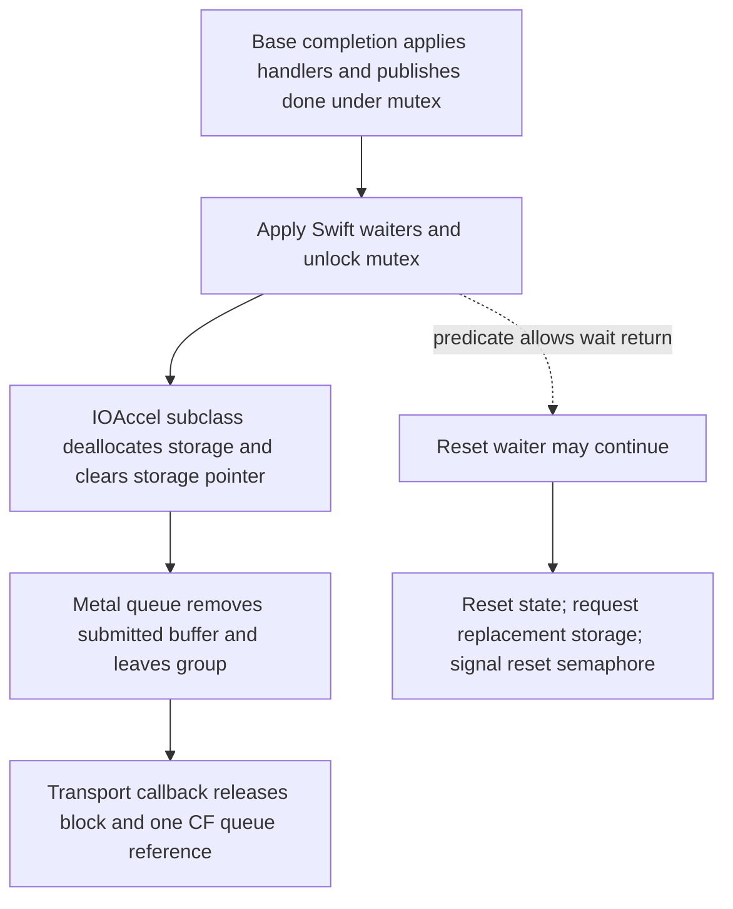

# IOAccel callback aliases, completion waits and storage reuse

The inspected `commitAndReset` path waits for a Metal completion predicate,
resets command-buffer state and obtains replacement storage. Storage deallocation
can return storage to a pool rather than free it. The two callback-pointer
aliases have no additional direct references in the bounded Metal code scan
beyond their producer stores. **Neither the completion predicate nor this scan
proves that notification callbacks have drained, aliases are globally cleared,
or kernel mappings have been reclaimed.**

This extends the [block-ownership study](ioaccel-block-ownership.md). It records
static paths and their boundaries; no command buffer was created, committed,
waited on or reset by the probe.

## Evidence and primary contracts

Host reconfirmed on 2026-10-02: macOS 26.4.1 build 25E253, x86_64, reported
Ryzen 5 5600GT, PCI `1002:1638:c9`. SDK headers are from 26.5. The unchanged
public metadata child was rebuilt with debug information and stopped at
`probe.m:48` after public enumeration. LLDB inspected loaded instructions and
bounded code bytes; it evaluated no target expressions or private methods.
Enumeration can initialize the existing stack internally.

Ignored `out/ioaccel-buffer-reuse/` preserves commands, UTC times, stdout/stderr
and status. Captures `reset-storage`, `waits-cleanup`, `storage-verified`,
`init-resources` and `alias-scan` supply the new evidence. The earlier
`out/ioaccel-block-ownership/` producer and completion/subclass-deallocation
captures, plus `out/ioaccel-lifecycle-detail/` registered callback, are reused.
Source and borrowed-evidence digests, verification and limitations are recorded
in `experiment-index.json` and `source-index.json` locally.

One initial storage batch exited 1 at a function-name lookup for ivar data;
its five preceding successful disassemblies remain saved. The same five
disassemblies were reproduced successfully without that lookup. The alias reader
derives the data slots from the known producer instructions instead of treating
the failed lookup as absent fields. Enumeration's locale warning is retained.

Primary references read on 2026-10-02:

- [Apple `waitUntilCompleted`](https://developer.apple.com/documentation/metal/mtlcommandbuffer/waituntilcompleted%28%29)
  specifies waiting for GPU execution and the command buffer's completion
  handlers. SDK `MTLCommandBuffer.h`, lines 338–354, declares synchronous scheduled
  and completed waits; its status enumeration assigns completed/error values 4/5.
  This public contract does not specify the private IOAccel callback's final
  block/CF releases or storage pooling.
- [Apple semaphore wait](https://developer.apple.com/documentation/dispatch/dispatch_semaphore_wait),
  corroborated by SDK `dispatch/semaphore.h`, defines decrement/wait and timeout
  results. SDK `dispatch/time.h` defines `DISPATCH_TIME_FOREVER` as all bits set.
  A semaphore wait is not a GPU fence or a notification drain contract.
- [POSIX condition wait](https://pubs.opengroup.org/onlinepubs/9799919799/functions/pthread_cond_wait.html)
  releases/reacquires the mutex around waiting and requires rechecking the
  predicate after wakeup. This supports interpreting the observed predicate loop,
  not inferring successful runtime delivery.

Apple's normal documentation pages supplied JavaScript shells; the web reader
could not consume their linked Markdown content. Ordinary `curl` captured the
official Markdown successfully. The POSIX web-reader request returned 403;
ordinary `curl` captured the primary page successfully. These tool-specific
failures and source/header SHA-256 digests are preserved locally. Public sources
and SDK 26.5 are not equated with the runtime's private kernel implementation.

## Callback aliases: the bounded search result

The producer copies scheduling and completion blocks, then writes each copied
pointer both to a submission entry and to the command buffer's corresponding
`_scheduledCallbackBlockPtr` or `_completedCallbackBlockPtr` field. The direct
field stores acquire no additional reference. The registered notification
callback invokes/releases the block received in its payload; it does not receive
a command-buffer object from which to clear these aliases.

The reader below derives both ivar-offset slot addresses from that producer in
the current launch. It reads Metal's `__TEXT.__text` (2,144,545 bytes here), finds
candidate RIP-relative displacements, then validates actual instructions from
their enclosing symbols. Exactly two references were validated: the producer's
slot-address loads at method-relative offsets 310 and 409. Thus, this scan found
no additional **direct RIP-relative references to those slots** in that section.

This is not a global field-access inventory: immediate object offsets, indirect
slot loads, instructions with excluded encodings, other sections and other images
can access the same fields. The inspected reset, completion, storage cleanup and
deallocation functions show no direct alias clear or alias-specific release.
Transitive object methods and vendor implementations remain boundaries. Do not
infer an extra owner, a leak, universal dangling-pointer use, or safe dereference
after release. A later producer store overwrites the aliases on its inspected
path; it does not reclaim an earlier copy by itself.

A supplementary loaded AMD image name search found four deallocation symbols
and no reset/completion symbols matching its pattern. This only describes that
symbol search. It neither proves inheritance for every vendor buffer nor rules
out stripped, indirect, hardcoded-offset or differently named implementations.
Apple AMD binaries remain observation references excluded from the finished stack.

## Reset sequence and its prerequisites

`MTLIOAccelCommandBuffer`'s initializer checks the result of its initial storage
request. With nonzero `synchronousDebugMode`, it creates `_commitAndResetSem`
with initial count 1; that creation result has no visible null check. The reset
method uses the stored semaphore unconditionally. Valid-mode, successful
initialization and subclass dispatch are therefore unresolved prerequisites;
the instructions do not authorize resetting an arbitrary command buffer.

| Static reset stage | Observed operations | Boundary |
| --- | --- | --- |
| IOAccel subclass entry | Waits on `_commitAndResetSem` with all-bits-set timeout, gathers optional profiling/purged-resource state and calls `StorageFinalizeShmemHeader`. | No timeout or GPU wait is established by this semaphore alone. |
| Superclass before commit | Saves and detaches the current encoder, scheduled/completed handler lists and Swift waiter lists. Sends `commit`, then `waitUntilCompleted`. | These application handler/waiter lists are distinct from the two transport blocks. Complete commit dispatch is not traced here. |
| Superclass after wait | Saves old status; writes status/error to zero and scheduled/completed callback-done flags to false; restores saved encoder/lists and adjusts tracing state. | Error is zeroed without a visible release at this store. Complete error ownership is not established. Alias fields are not visibly cleared. |
| Status check | Old status equal to 4 returns through the normal path; other values enter a cold `MTLReportFailure` path. | SDK names 4 completed and 5 error; exact report policy/nonreturn behavior is not established. |
| IOAccel subclass return | Requests storage from the device's storage pool using superclass `retainedReferences`, stores the result in `_storage`, then signals `_commitAndResetSem`. | No visible null check of the replacement-storage result; acquisition/failure behavior is not proven by a successful initializer. |

The new storage can be the same pooled allocation or another allocation. No
particular identity, mapping reuse guarantee, GPU ordering or bounded completion
is inferred. The initializer's null check and the reset's unchecked store are
different paths, not evidence that either failure occurred on this host.

## What the completion wait actually observes

`_MTLCommandBuffer waitUntilCompleted` locks `_mutex`, tests
`_completedCallbacksDone`. An initially nonzero flag skips waiting; on the pending
branch, each condition wake is followed by a check for value 1. It unlocks on
the return path.
`waitUntilScheduled` uses the analogous scheduled predicate and condition.
Neither inspected loop uses a timed wait or examines the callback-pointer aliases.

In the base completion method, the completed handler list is applied, retained
objects are released/cleared and `signalCommandBufferAvailable` is sent. That
method may signal the **queue's `_commandBufferSemaphore`**, which is distinct
from `_commitAndResetSem`. The base completion method then takes `_mutex`, sets
`_completedCallbacksDone`, broadcasts, applies/clears Swift completed waiters and
unlocks. Under ordinary successful mutex/condition operation, a waiter must
reacquire that mutex before returning; it cannot skip the work protected by it.

The inspected outer call chain still has later work:



This is a static ordering graph within the inspected implementations. The dotted
edge is a possible wait boundary; cross-thread interleaving was not exercised.
The predicate is published before subclass storage cleanup, submitted-queue
bookkeeping and transport release. These instructions therefore do not establish
that `waitUntilCompleted` drains those outer operations or all scheduled replies.
Do not infer a runtime race or its absence: vendor overrides, execution context,
commit dispatch and other serialization must be resolved before claiming reuse
safety. The [notification cancellation limits](ioaccel-lifecycle.md) also remain.

## Storage reset, pooling and cleanup

`StorageFinalizeShmemHeader` finalizes segment/header bookkeeping and sets a
terminal marker bit on its current header. Its inspected code does not wait for
GPU execution or release a notification block.

`MTLIOAccelCommandBufferStorageDealloc` selects a branch from storage offset 8:

| Branch | Visible cleanup | Remaining ownership boundary |
| --- | --- | --- |
| Pool pointer non-null | Calls `StorageReset`, then `StoragePoolReturnStorage`. Reset releases extra pooled resources, sends `releaseAllObjectsAndReset` to optional resource lists and resets storage cursors/segment state. Return clears the pool pointer, changes the state marker from `-1` to `-2`, inserts storage into a free list under a lock and sends `kickCleanupQueue` to the device. | Pool retention/purge and transitive object cleanup are not a kernel unmap or notification drain proof. |
| Pool pointer null | Releases/clears shared-memory objects at offsets `0x20` and `0x40`, destroys the IOAccel resource list, calls `StorageReleaseAllResources`, then frees storage. | Shared-memory release may itself return objects to a pool; actual mapping reclamation remains unverified. |

`StoragePoolCreateStorage` removes a pooled entry under its lock and changes its
state marker from `-2` to `-1`, or calls `StorageCreateExt` when the free list is
empty. It adjusts an optional retained-resource list and sets the pool pointer
on successful paths. An allocation failure path can return null. Pool recycling
therefore does not mean every submission allocates/frees all storage.

`StorageReleaseAllResources` walks/frees a pooled-resource table, releases extra
resources, resets/releases optional resource lists and requests device cleanup.
`StorageReleaseDeviceShmems` releases/clears the two shared-memory fields.
`MTLIOAccelDeviceShmemRelease` has pool-return and object-release paths; an
indirect release target and actual kernel destruction are not resolved here.

The previously inspected IOAccel completion method calls its superclass, then
calls storage deallocation and clears `_storage`. IOAccel deallocation repeats
storage cleanup only when the pointer is non-null, releases the reset semaphore
and other objects, then calls its superclass. Base deallocation destroys
conditions/mutex, processes handler/waiter lists and releases other state. These
are cleanup call sites; they do not prove that all waiters or GPU requests have
finished before object destruction. Retained transport copies can also keep the
buffer alive and delay deallocation, as described in the ownership study.

## Reproduction

Build the unchanged public metadata child from
[metal-loader-study.md](metal-loader-study.md) in a new ignored directory, using
the [capture procedure](metal-admission.md). Record OS/build, PCI/revision,
architecture, SDK, UTC time, stdout/stderr and status. Verify the stop at
`probe.m:48`, then run these read-only debugger commands:

```text
disassemble --name "-[MTLIOAccelCommandBuffer initWithQueue:retainedReferences:synchronousDebugMode:]"
disassemble --name "-[MTLIOAccelCommandBuffer commitAndReset]"
disassemble --name "-[_MTLCommandBuffer commitAndReset]"
disassemble --name "-[_MTLCommandBuffer commitAndReset].cold.1"
disassemble --name "-[_MTLCommandBuffer waitUntilCompleted]"
disassemble --name "-[_MTLCommandBuffer waitUntilScheduled]"
disassemble --name "-[_MTLCommandBuffer didCompleteWithStartTime:endTime:error:]"
disassemble --name "-[_MTLCommandBuffer signalCommandBufferAvailable]"
disassemble --name "-[_MTLCommandBuffer dealloc]"
disassemble --name MTLIOAccelCommandBufferStorageFinalizeShmemHeader
disassemble --name MTLIOAccelCommandBufferStorageDealloc
disassemble --name MTLIOAccelCommandBufferStorageReset
disassemble --name MTLIOAccelCommandBufferStoragePoolReturnStorage
disassemble --name MTLIOAccelCommandBufferStoragePoolCreateStorage
disassemble --name MTLIOAccelCommandBufferStorageReleaseAllResources
disassemble --name MTLIOAccelCommandBufferStorageReleaseExtraResources
disassemble --name MTLIOAccelCommandBufferStorageReleaseDeviceShmems
disassemble --name MTLIOAccelDeviceShmemRelease
```

The bounded alias reader below reads code/metadata only. Save it in the new
output directory and invoke `script exec(open("<path>").read())` after stopping.
It requires this x86_64 producer layout, a single producer match, a section at
most 4 MiB and bounded enclosing symbols. It does not enumerate every encoding
or field access. Preserve assertion/read failures as unavailable evidence, and
inspect diagnostics even if LLDB exits 0. Stop at denied inspection. Runtime
addresses must come from the current launch; padding is not interpreted as code.

For a controlled bound-rejection check, copy the reader inside the ignored output
directory, replace `4 * 1024 * 1024` with `1`, and run that copy at the same
breakpoint. The saved check rejects the section before `ReadMemory`, produces
`AssertionError` and emits no scan summary. LLDB still exits 0; the diagnostic
must therefore be checked separately from command status. This is a reader guard
check, not evidence about GPU or private-driver failure handling.

### Bounded alias-slot reader

```python
# Own-child read-only scan, limited to x86_64 Metal __TEXT.__text.
import json, re, struct, lldb
target = lldb.debugger.GetSelectedTarget()
process = target.GetProcess()
assert process.GetState() == lldb.eStateStopped
assert target.GetTriple().startswith('x86_64') and target.GetAddressByteSize() == 8
matches = target.FindFunctions('-[MTLIOAccelCommandQueue submitCommandBuffers:count:]')
assert matches.GetSize() == 1, 'producer unavailable or ambiguous'
context = matches.GetContextAtIndex(0)
slots = {}
for instruction in context.GetSymbol().GetInstructions(target):
    for field in ('_scheduledCallbackBlockPtr', '_completedCallbackBlockPtr'):
        if 'MTLIOAccelCommandBuffer.' + field not in instruction.GetComment(target):
            continue
        operand = re.fullmatch(r'(0x[0-9a-f]+)\(%rip\), %rcx', instruction.GetOperands(target))
        assert instruction.GetMnemonic(target) == 'leaq' and operand
        slot = instruction.GetAddress().GetLoadAddress(target) + instruction.GetByteSize() + int(operand.group(1), 16)
        assert slot not in slots
        slots[slot] = field
assert len(slots) == 2, 'unexpected ivar references'
section = context.GetModule().FindSection('__TEXT').FindSubSection('__text')
assert section.IsValid() and 0 < section.GetByteSize() <= 4 * 1024 * 1024
base = section.GetLoadAddress(target)
error = lldb.SBError()
data = process.ReadMemory(base, section.GetByteSize(), error)
assert error.Success() and len(data) == section.GetByteSize(), str(error)
# Candidate disp32 ending at the instruction end; other encodings are excluded.
candidates = {}
for offset in range(len(data) - 3):
    destination = base + offset + 4 + struct.unpack_from('<i', data, offset)[0]
    if destination in slots:
        symbol = target.ResolveLoadAddress(base + offset).GetSymbol()
        assert symbol.IsValid(), 'candidate has no symbol'
        start = symbol.GetStartAddress().GetLoadAddress(target)
        end = symbol.GetEndAddress().GetLoadAddress(target)
        assert start <= base + offset < end and end - start <= 16384
        candidates[start] = symbol
hits = []
for start, symbol in sorted(candidates.items()):
    for instruction in symbol.GetInstructions(target):
        operand = re.search(r'(-?0x[0-9a-f]+)\(%rip\)', instruction.GetOperands(target))
        if not operand:
            continue
        address = instruction.GetAddress().GetLoadAddress(target)
        destination = address + instruction.GetByteSize() + int(operand.group(1), 16)
        if destination in slots:
            hits.append({'field': slots[destination], 'symbol': symbol.GetName(),
                         'instruction_offset': address - start,
                         'mnemonic': instruction.GetMnemonic(target),
                         'operands': instruction.GetOperands(target)})
assert hits, 'no validated instruction references'
print(json.dumps({'section_bytes': len(data), 'candidate_symbols': len(candidates),
                  'validated_direct_rip_slot_references': hits,
                  'limits': 'Metal __text only; excludes immediate-offset, indirect, other-section and other-image accesses'}))
```

## Remaining experiments and gates

The [generic XNU study](xnu-mapping-lifecycle.md) now records map ownership,
explicit unmap, close/no-senders and task VM removal. It distinguishes its pinned
source revision from the different installed kernel and unavailable family
hooks. The [async-reply study](xnu-async-replies.md) adds generic message and port
accounting, while actual family production/cardinality remains unavailable.
The [installed dispatch comparison](iokit-async-dispatch.md) matches the user-space
receive path and wrappers with source; IOAcceleratorFamily2 reply production is
the next focused read-only task. Do not create mappings, open experimental clients or exercise teardown on the
working GPU. Vendor reset dispatch and transitive resource methods remain
separate unresolved interfaces.

Future implementation gates require an experimental environment and recovery
path under [AGENTS.md](../AGENTS.md):

| Gate | Measurable success criterion |
| --- | --- |
| Reuse boundary | A documented generation/drain boundary prevents any old callback from reading, freeing or mutating replacement storage; include scheduling/completion reply order variations. |
| Alias ownership | Each stored token has a documented owner and invalidation point; duplicates, loss and late replies do not double-release or access invalid state. |
| Allocation/reset failure | Every acquired object is accounted for; null allocation and error completion produce an explicit bounded outcome without using invalid semaphore/storage state. |
| Pool and mapping lifecycle | Repeated cycles, purge and client exit reclaim allocations at documented boundaries; distinguish intentional pool retention from unreclaimed state. |

No reset, concurrency, GPU completion, kernel mapping reclamation or independent
driver functionality has been dynamically verified. No Apple implementation code
is incorporated into the driver; the reproduction reader is project inspection
code and the conclusions remain specifications and observations.
