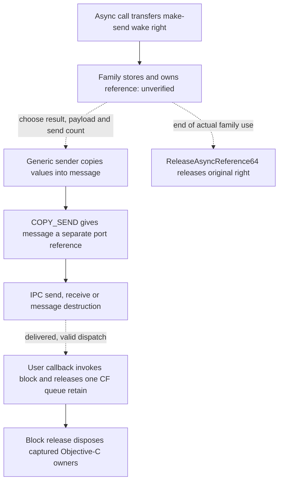

# Generic async replies and wake-port ownership

Pinned XNU source now connects async references, message packing, Mach send
rights and the IOKitUser callback dispatcher. It supplies generic ownership and
layout constraints, **not proof that IOAccelerator produces, validates or
delivers one reply for each scheduling/completion block**.

This continues the [notification lifecycle](ioaccel-lifecycle.md),
[block ownership](ioaccel-block-ownership.md) and
[generic mapping study](xnu-mapping-lifecycle.md). No callbacks, experimental
clients, queues, mappings or GPU requests were created or sent.

## Evidence and provenance

Primary sources read on 2026-10-02:

| Source | Revision and locations |
| --- | --- |
| [XNU import](https://github.com/apple-oss-distributions/xnu/commit/f6217f891ac0bb64f3d375211650a4c1ff8ca1ea) | `f6217f891ac0bb64f3d375211650a4c1ff8ca1ea`, `xnu-12377.1.9` |
| [IOKitUser import](https://github.com/apple-oss-distributions/IOKitUser/commit/323ead896d04424f87184d8f6ff0cce811aab106) | `323ead896d04424f87184d8f6ff0cce811aab106`, `IOKitUser-100231.100.18.0.1` |
| [device.defs](https://github.com/apple-oss-distributions/xnu/blob/f6217f891ac0bb64f3d375211650a4c1ff8ca1ea/osfmk/device/device.defs#L629), [std_types.defs](https://github.com/apple-oss-distributions/xnu/blob/f6217f891ac0bb64f3d375211650a4c1ff8ca1ea/osfmk/mach/std_types.defs#L127) | Variable reference-array maximum 8; async method's wake port uses make-send disposition |
| [IOUserClient.cpp](https://github.com/apple-oss-distributions/xnu/blob/f6217f891ac0bb64f3d375211650a4c1ff8ca1ea/iokit/Kernel/IOUserClient.cpp#L2297), [IOUserClient.h](https://github.com/apple-oss-distributions/xnu/blob/f6217f891ac0bb64f3d375211650a4c1ff8ca1ea/iokit/IOKit/IOUserClient.h#L369) | Flag bits at 82–84; setters at 1343–1377; release at 2237–2257; send at 2283–2384; async method at 5236–5351; ownership declaration at header 369–375 |
| [OSMessageNotification.h](https://github.com/apple-oss-distributions/xnu/blob/f6217f891ac0bb64f3d375211650a4c1ff8ca1ea/iokit/IOKit/OSMessageNotification.h#L44), [device_types.h](https://github.com/apple-oss-distributions/xnu/blob/f6217f891ac0bb64f3d375211650a4c1ff8ca1ea/osfmk/device/device_types.h#L100) | Message/type IDs, reference indices, 16-argument maximum, 32/64-bit headers and result/argument types |
| [IOKitLib.c](https://github.com/apple-oss-distributions/IOKitUser/blob/323ead896d04424f87184d8f6ff0cce811aab106/IOKitLib.c#L1183), [IOKitLib.h](https://github.com/apple-oss-distributions/IOKitUser/blob/323ead896d04424f87184d8f6ff0cce811aab106/IOKitLib.h#L1381) | LP64 header choice at 68; dispatcher at 1177–1302; async wrapper at 1904–1985; callback types at header 1381–1418 |
| [ipc_right.c](https://github.com/apple-oss-distributions/xnu/blob/f6217f891ac0bb64f3d375211650a4c1ff8ca1ea/osfmk/ipc/ipc_right.c#L2157), [iokit_rpc.c](https://github.com/apple-oss-distributions/xnu/blob/f6217f891ac0bb64f3d375211650a4c1ff8ca1ea/osfmk/device/iokit_rpc.c#L230), [ipc_port.c](https://github.com/apple-oss-distributions/xnu/blob/f6217f891ac0bb64f3d375211650a4c1ff8ca1ea/osfmk/ipc/ipc_port.c#L2996) | Make-send acquisition; IOKit release forwards to naked-send release, decrementing right/reference ownership |
| [ipc_object.c](https://github.com/apple-oss-distributions/xnu/blob/f6217f891ac0bb64f3d375211650a4c1ff8ca1ea/osfmk/ipc/ipc_object.c#L631), [ipc_kmsg.c](https://github.com/apple-oss-distributions/xnu/blob/f6217f891ac0bb64f3d375211650a4c1ff8ca1ea/osfmk/ipc/ipc_kmsg.c#L5004) | Kernel copy-send acquisition; copyout port reversal at 3638–3639; user-header contraction at 4572–4589; message copy at 4905–4962; dead-port send at 5202–5223 |
| [ipc_mig.c](https://github.com/apple-oss-distributions/xnu/blob/f6217f891ac0bb64f3d375211650a4c1ff8ca1ea/osfmk/kern/ipc_mig.c#L111), [message.h](https://github.com/apple-oss-distributions/xnu/blob/f6217f891ac0bb64f3d375211650a4c1ff8ca1ea/osfmk/mach/message.h#L1239), [ipc_mqueue.c](https://github.com/apple-oss-distributions/xnu/blob/f6217f891ac0bb64f3d375211650a4c1ff8ca1ea/osfmk/ipc/ipc_mqueue.c#L432) | Kernel send options and error cleanup; ordinary versus kernel queue limits and zero-timeout behavior |

Fresh read-only OS/kernel queries again report macOS 26.4.1 build 25E253,
Darwin 25.4.0 and `xnu-12377.101.15~1/RELEASE_X86_64`. The pinned XNU version
differs. SDK 26.5 supplied general Mach dependencies for the offline x86_64
layout build; neither SDK nor IOKitUser source is asserted to match the installed
dispatcher. The earlier baseline's PCI `1002:1638:c9` and Ryzen 5 5600GT
observation is reused without another PCI/CPU query.

Ignored `out/xnu-async-replies/` saves commands, UTC times, stdout/stderr/status,
layout source/results, fixture checks and indexes. Initial sources are in
`out/xnu-async-sources/`; the final documented collection is in
`out/xnu-async-reproduced/`. Its 24 source/header/license files match both pinned
commit trees by Git blob hash and SHA-256, and match the initial reads.
The earlier queue/callback and Metal producer captures are reused; no new LLDB
session was run. Web-reader requests for the notification header failed with
cache misses; ordinary pinned-source collection succeeded. A no-match search in
`IOService.h` is retained; the option definition is in `IOUserClient.h` instead.

Original notices and the pinned `APPLE_LICENSE` remain local. These are study
inputs; no Apple implementation code is incorporated into tracked driver code.
Any future source reuse needs a separate license review.

## Registration reference and wake-port ownership

The IDL declares a make-send wake port and a variable array of at most eight
64-bit reference words. Generic make-send copyin creates a send right from the
caller's receive right. The kernel async-method helper requires a reference
count of at least 1, replaces slot 0 with the kernel wake-port value plus its
64-bit flag, and passes the reference pointer/count and port to virtual method
dispatch. This is distinct from the caller's user-space port name.

| Reference slot | Generic role | Ownership limit |
| --- | --- | --- |
| 0 | Kernel wake port with low-bit flags: bit 0 selects 64-bit replies; bit 1 records a logged send error. | Not a user-space callback or block pointer. The flags are masked out when sending/releasing. |
| 1 | Callback function value | Copied integer value; the setters/sender do not retain an Objective-C object or copy a block. |
| 2 | Refcon value | Same shallow-value behavior; object lifetime belongs to the family/user-space contract. |
| 3–7 | Remaining reference words | The 64-bit sender copies these too. Family initialization and storage of the full reference must be accounted for. |

`setAsyncReference64` assigns slots 0–2, preserves the low flag bits and, in its
task-taking overload, can set the 64-bit flag. It does not acquire another send
right or initialize every remaining word. `releaseAsyncReference64` masks the
flags and releases one non-null naked send right; it neither clears the stored
reference nor proves that outstanding users have finished.

The header requires balancing the wake-port reference for each async method
call. The generic helper does not release it after external-method dispatch.
Actual generated MIG rejection cleanup and the private family's retained-copy,
error and teardown paths remain unverified. The IDL maximum and the C helper's
minimum are source constraints, not a complete installed-kernel validation proof.
In particular, a count of 1 does not by itself supply callback/refcon slots.

The observed queue registration uses selector 0, reference count 3, callback in
slot 1 and queue refcon in slot 2. That count is distinct from the reply argument
count. One held wake-port reference can support multiple send attempts; it is
not one wake-port acquisition per copied scheduling/completion block.

## Sender packing and send status

`sendAsyncResult64` delegates to `_sendAsyncResult64` with options 0. The helper
masks slot 0 and returns success immediately for a null reply port, before its
argument-limit check. A non-null port with more than 16 arguments returns
message-too-large without sending. The legacy conversion wrapper has its own
earlier count check; these are different paths.

For a constructed reply, the helper zeros its stack aggregate, uses message ID
53 and async notification type 150, sets destination disposition `COPY_SEND`
and supplies no local/reply port. The 64-bit branch copies reference words 1–7
while leaving wire slot 0 zero, stores the supplied callback result and copies
`n` 64-bit argument words. The 32-bit branch truncates reference/argument values
to its 32-bit representation. These copy operations acquire no retain on the
user-process objects whose pointer values appear in those words.

The offline compiler check, using the pinned notification declarations and SDK
Mach dependencies on x86_64, produced these layout values:

| Item | Bytes |
| --- | --- |
| SDK user Mach header | 24 |
| 32-bit / 64-bit notification headers | 40 / 72 |
| Completion result prefix | 4 |
| Full 32-bit / 64-bit bodies at 16 arguments | 108 / 208 |
| First 64-bit argument relative to notification-body start | 76 |
| Tail padding of the 64-bit body | 4 |

The sender computes its 64-bit body size as `208 - (16-n)*8`, or `80+8*n`.
Declared content size is `4+8*n`; the four padding bytes are not argument data.
XNU contracts the native kernel Mach header on user copyout. With the measured
24-byte user header, a simple 64-bit envelope would total `104+8*n` bytes.
This is a source-derived layout expectation, not a captured IOAccel message or
a build of the pinned kernel. Kernel native-header size is not inferred from
the SDK user-header size.

| Send path | Source behavior | Consequence |
| --- | --- | --- |
| Default options | Kernel helper uses `MACH_SEND_ALWAYS`, bypassing the ordinary queue limit while below the kernel limit. Thread `TH_OPT_HONOR_QLIMIT` can replace that option with a timeout. | Header prose about infinite queueing is not a guarantee of unbounded buffering. |
| `kIOUserNotifyOptionCanDrop` | Uses the timeout option with zero timeout; a full queue can return `MACH_SEND_TIMED_OUT`. | No retry or token cleanup is supplied by this helper. |
| Other send error | Non-success/non-timeout with a clear logged-error bit sets that bit and logs; the helper returns the send result. | The original held port/reference and concurrent reference access remain the caller's responsibility. |
| Destination becomes inactive | Inspected IPC send path destroys the message and returns success. | Successful send status does not establish receipt or callback execution. |

`COPY_SEND` acquires a message-owned port right/reference. The kernel copies
the stack message; post-copyin send errors destroy that message and its acquired
resources. This is separate from the original async registration right released
by `releaseAsyncReference64`. It also supplies no generic release of an Objective-C
block/queue represented only as body bytes.



The dotted edges are missing production/lifetime boundaries. No call to a
generic sender selects the number of replies per accepted submission, enforces
exactly-once delivery or identifies a reset generation.

## Dispatcher and the saved consumer

The LP64 IOKitUser dispatcher chooses the 64-bit notification header. It checks
message ID, finds a simple or complex header, derives remaining bytes from
`msgh_size`, applies the type's size-adjustment bits and divides completion
argument bytes by pointer size. It obtains function/refcon from slots 1/2 and
selects dedicated callbacks for counts 0, 1 or 2; larger counts use the argument
array plus count. In this source function the CF buffer-size parameter is unused,
and no explicit async maximum, minimum body length or function-value validation
is performed. Other receive-layer checks and the installed implementation are
not established by this source observation.

For the measured simple 64-bit body, its count calculation is
`(80+8*n-72-4)/8`, which truncates the extra four padding bytes and recovers `n`.
The dispatcher does not use declared content size as its argument-count bound.
Unsigned subtraction of an undersized body can instead produce a very large
count. On LP64, `sizeof` promotes the subtraction to 64 bits before division
and assignment back to `uint32_t`; a zero remaining length produces
`0xffffffff`. The offline compiler/arithmetic checks demonstrate this without
invoking the dispatcher or constructing a live Mach message.

The dispatcher's notifier-reference check applies when the **received remote
port** is non-null. Generic async replies supply no sender local/reply port;
normal copyout places that reply value in received remote and the destination
in received local. Thus the wake port must not be confused with that notifier
check. The check is not a generic cancellation or callback drain boundary for
this simple reply shape.

The saved x86_64 IOAccel callback reads 64-bit fields at argument offsets 0, 16
and 32, and a 32-bit field at 48. Under the generic eight-byte argument layout,
these are words 0, 2, 4 and the low half of word 6. They require **52 meaningful
argument bytes, hence at least seven complete argument words**. A six-word body
may place tail padding at the final load; that is not a seventh declared argument.
The callback does not inspect its count in the saved instructions. Generic
counts 0–16 are therefore not all sufficient for this consumer; 0/1/2 also
select different call shapes. The actual private producer's count, intervening
words, time units and validation remain unavailable.

Keep four result channels separate:

| Value | Meaning established here |
| --- | --- |
| Async registration/submission API return | Synchronous transport/method result; not a callback delivery record |
| Generic send helper return | Mach send-path status, including the null/dead-port success limits above |
| Completion prefix `result` | Supplied callback result; the saved IOAccel callback asserts its result argument is zero |
| Payload word 6, low 32 bits | Forwarded to the Metal block; nonzero is converted through `initWithIOAccelError:` in the saved block consumer |

The earlier studies' callback “transport result” denotes that callback argument,
not the generic send helper's return. Its relation to actual GPU outcomes is
not established. The two copied blocks/two CF queue retains are separate from
Mach port ownership; dropping a message or receive port does not supply their
family-specific disposal protocol.

## Reproduction and offline checks

Reuse the collector in [xnu-mapping-lifecycle.md](xnu-mapping-lifecycle.md),
replacing only its `packages` assignment with the following. Save the resulting
script under ignored `out/`, and run it with a new ignored output directory.
It preserves each download and verifies the explicit pinned commit trees.
The final reproduction completed 28 downloads and verified 24 source/header/
license files. Supplementary source files retain the searches used to locate
the send and option definitions.

```python
packages = [
    ('xnu', 'f6217f891ac0bb64f3d375211650a4c1ff8ca1ea', [
        'APPLE_LICENSE', 'iokit/Kernel/IOUserClient.cpp',
        'iokit/IOKit/IOUserClient.h', 'iokit/IOKit/OSMessageNotification.h',
        'iokit/IOKit/IOTypes.h', 'iokit/IOKit/IOReturn.h',
        'osfmk/device/device.defs', 'osfmk/device/device_types.defs',
        'osfmk/device/device_types.h', 'osfmk/device/iokit_rpc.c',
        'osfmk/ipc/ipc_kmsg.c', 'osfmk/ipc/ipc_kmsg.h',
        'osfmk/ipc/ipc_mqueue.c', 'osfmk/ipc/ipc_port.c',
        'osfmk/mach/message.h', 'osfmk/ipc/mach_msg.c',
        'osfmk/ipc/ipc_object.c', 'osfmk/ipc/ipc_right.c',
        'osfmk/mach/std_types.defs', 'iokit/IOKit/IOKitServer.h',
        'osfmk/kern/ipc_mig.c', 'iokit/IOKit/IOService.h']),
    ('IOKitUser', '323ead896d04424f87184d8f6ff0cce811aab106',
     ['IOKitLib.c', 'IOKitLib.h'])]
```

For the layout build, create `include/IOKit/OSMessageNotification.h` and
`include/IOKit/IOReturn.h` symlinks in a new ignored build directory to the
corresponding collected `xnu-` files. The remaining general headers come from
the selected macOS SDK. Save this project inspection code as `layout.cpp`:

```cpp
#include <IOKit/OSMessageNotification.h>
#include <cstddef>
#include <cstdio>

struct Body32 {
    OSNotificationHeader header;
    IOAsyncCompletionContent completion;
    uint32_t arguments[kMaxAsyncArgs];
};
struct Body64 {
    OSNotificationHeader64 header;
    IOAsyncCompletionContent completion;
    io_user_reference_t arguments[kMaxAsyncArgs] __attribute__((packed));
};
int main() {
    static_assert(sizeof(void *) == 8 && sizeof(io_user_reference_t) == 8 && sizeof(size_t) == 8);
    uint32_t leftOver = 0;
    leftOver = (leftOver - sizeof(IOAsyncCompletionContent)) / sizeof(void *);
    std::printf("{\"mach_user_header\":%zu,\"notification32\":%zu,\"notification64\":%zu,\"completion\":%zu,\"body32\":%zu,\"body64\":%zu,\"arguments64_offset\":%zu,\"maximum_arguments\":%d,\"unsigned_underflow_count\":%u}\n",
        sizeof(mach_msg_header_t), sizeof(OSNotificationHeader), sizeof(OSNotificationHeader64),
        sizeof(IOAsyncCompletionContent), sizeof(Body32), sizeof(Body64),
        offsetof(Body64, arguments), kMaxAsyncArgs, leftOver);
}
```

```sh
xcrun clang++ -std=c++17 -Wall -Wextra -Werror -I out/async-layout/include out/async-layout/layout.cpp -o out/async-layout/layout
out/async-layout/layout > out/async-layout/layout.json
python3 out/async-layout/check-layout.py out/async-layout/layout.json
```

Save the following as `check-layout.py`. It checks the compiler geometry and
uses a bounded reader on inert byte fixtures. It never invokes a function/block
pointer, sends a message or allocates a GPU resource. The reader's rejection
policy is a study guard, not an implementation of Apple's dispatcher.

```python
import json, struct, sys
from pathlib import Path
layout = json.loads(Path(sys.argv[1]).read_text())
assert layout['notification64'] == 72 and layout['completion'] == 4
assert layout['maximum_arguments'] == 16 and layout['arguments64_offset'] == 76
padding = layout['body64'] - layout['arguments64_offset'] - 16 * 8
assert padding == 4
for count in range(17):
    body_bytes = layout['body64'] - (16 - count) * 8
    inferred = (body_bytes - layout['notification64'] - layout['completion']) // 8
    assert inferred == count

def read_consumer_fields(arguments):
    if len(arguments) % 8 or not 52 <= len(arguments) <= 16 * 8:
        raise ValueError('requires 7..16 complete 64-bit argument words')
    return (struct.unpack_from('<Q', arguments, 0)[0],
            struct.unpack_from('<Q', arguments, 16)[0],
            struct.unpack_from('<Q', arguments, 32)[0],
            struct.unpack_from('<I', arguments, 48)[0])

for count in (7, 16):
    data = b''.join(struct.pack('<Q', word) for word in range(1, count + 1))
    assert read_consumer_fields(data) == (1, 3, 5, 7)
# Six words plus four padding bytes do not supply a seventh argument.
rejected = [b'', bytes(6 * 8), bytes(51), bytes(52), bytes(17 * 8)]
for data in rejected:
    try:
        read_consumer_fields(data)
    except ValueError:
        continue
    raise AssertionError('invalid fixture accepted')
# Model LP64 sizeof promotion, division, then uint32_t assignment.
# Do not invoke Apple's dispatcher.
underflow_count = (((0 - layout['completion']) & 0xffffffffffffffff) // 8) & 0xffffffff
assert underflow_count == layout['unsigned_underflow_count'] == 0xffffffff
print(json.dumps({'count_layout_cases': 17, 'accepted_field_fixtures': 2,
                  'rejected_field_fixtures': len(rejected),
                  'unsigned_underflow_model_count': underflow_count,
                  'limits': 'offline arithmetic/byte reading; no callbacks, messages or GPU execution'}))
```

The check passed 17 count/layout cases and two sufficient field fixtures,
rejected five incomplete/excess fixtures and recorded the unsigned-underflow
model separately. All 13 existing tests passed, including public metadata
inventory; enumeration may initialize the existing stack internally. Source/
inspection-code digests, borrowed evidence, document links and whitespace were
checked. Independent review verified the LP64 arithmetic correction and the
corrected flag-definition citation, with no remaining findings. These results
verify collection and offline reasoning, not private message delivery, kernel
cleanup or GPU functionality.

## Remaining interfaces and gates

The [installed dispatch comparison](iokit-async-dispatch.md) found the host's
IOKit dispatcher, dispatch-queue callout, async wrappers and generated client stub
consistent with these source expectations. Two differences do not affect behavior:
the callouts do not set up arguments the dispatcher ignores. The comparison adds
client-only count checks, a shared output-count hazard and an unwritten
registration slot 0. Private-family/kernel production remains the next missing
interface.

Future dynamic work requires an experimental environment and recovery path
under [AGENTS.md](../AGENTS.md):

| Gate | Measurable success criterion for our future adapter |
| --- | --- |
| Port ownership | Each registration acquisition balances once after its last user; rejection, replacement, client death and close cannot leak or double-release rights. |
| Envelope and identity | Validate supplied buffer length, declared counts, callback/token identity and generation before reading or invoking anything; padding is not argument data. |
| Terminal delivery | Every accepted scheduling/completion token reaches one documented terminal outcome; duplicate, lost, late and malformed messages cannot free active state. |
| Send failure/backpressure | Queue saturation, timeout, null/dead destination and receiver exit have bounded outcomes and preserve actual error/cleanup accounting. |
| Teardown and reuse | A verified drain/invalidation boundary protects callback state, mappings and replacement storage, independently of receive-port or connection destruction. |

No private reply count/order, actual wake-port
release schedule, callback cancellation, GPU completion or independent Metal
admission has been dynamically verified.
