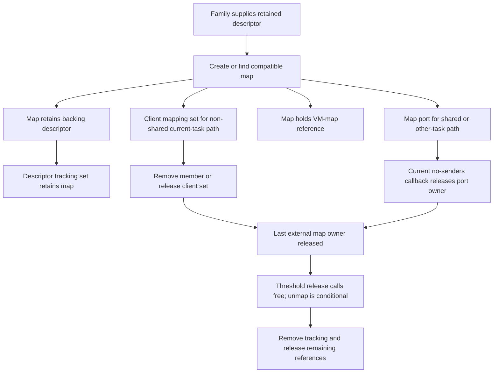

# Generic XNU mapping and user-client teardown ownership

The pinned public XNU source identifies map owners and cleanup paths, but does
not establish when the installed IOAccelerator family reclaims a mapping or its
backing storage. **Connection close, object destruction, task address-space
removal and GPU request termination are separate boundaries.**

This source study follows the [context lifecycle](ioaccel-lifecycle.md) and
[storage reuse](ioaccel-buffer-reuse.md) observations. It implements no driver
and creates no mappings or experimental connections.

## Provenance and evidence limits

Read on 2026-10-02 from Apple's primary repositories:

| Reference | Pinned revision | Scope |
| --- | --- | --- |
| [XNU import](https://github.com/apple-oss-distributions/xnu/commit/f6217f891ac0bb64f3d375211650a4c1ff8ca1ea) | `f6217f891ac0bb64f3d375211650a4c1ff8ca1ea`, import `xnu-12377.1.9`, 2025-10-16 | Generic IOKit, object ownership, IPC and VM source |
| [IOKitUser import](https://github.com/apple-oss-distributions/IOKitUser/commit/323ead896d04424f87184d8f6ff0cce811aab106) | `323ead896d04424f87184d8f6ff0cce811aab106`, import `IOKitUser-100231.100.18.0.1`, 2026-04-17 | Public declarations and user-space transport wrappers |

Fresh read-only `sw_vers` and `sysctl -n kern.osrelease kern.osversion kern.version`
returned macOS 26.4.1 build 25E253, Darwin 25.4.0, kernel
`xnu-12377.101.15~1/RELEASE_X86_64`. The pinned XNU import is a different version.
Its agreement with the installed implementation is unverified; neither matching
major versions nor IOKitUser's import date closes that gap. The preceding host
baseline records PCI `1002:1638:c9` and reported Ryzen 5 5600GT; those fields were
not queried again for this source-only task.

Ignored `out/xnu-mapping-lifecycle/` retains source files, commit/tree metadata,
SHA-256 and Git blob hashes, command arguments, UTC times, stdout/stderr and exit
status. `out/xnu-mapping-reproduced/` is the fresh reproduction. Its 21 source,
header and license files match the blobs in each commit's explicitly identified
tree. The earlier context disassembly is reused without a new LLDB session.

An initial provenance assertion expected a commit-named tree API response's
`sha` to equal the commit's tree SHA. The returned value instead identified the
commit; the failed assertion and its exit 1 reproduction are retained. The
verified collector requests the explicit tree SHA from commit metadata and
checks that response before checking source blobs. No source absence or runtime
failure is inferred from that metadata-check failure.

IOKit implementation files carry APSL 2.0 notices. The pinned
[APPLE_LICENSE](https://github.com/apple-oss-distributions/xnu/blob/f6217f891ac0bb64f3d375211650a4c1ff8ca1ea/APPLE_LICENSE)
and original file notices are retained locally and were read. No Apple
implementation code is incorporated into tracked driver code. Any later source
reuse requires its own license review.

## Source locations

Line numbers below belong to these exact revisions, rather than installed SDK
headers or a moving branch. The function names also permit a local `rg` lookup.

| Primary source | Locations used |
| --- | --- |
| [IOKitLib.c](https://github.com/apple-oss-distributions/IOKitUser/blob/323ead896d04424f87184d8f6ff0cce811aab106/IOKitLib.c#L1479) | 226–231 `IOObjectRelease`; 1479–1488 `IOServiceClose`; 1689–1708 connection references; 1729–1784 map/unmap wrappers |
| [IOKitLib.h](https://github.com/apple-oss-distributions/IOKitUser/blob/323ead896d04424f87184d8f6ff0cce811aab106/IOKitLib.h#L637) | 637–665 close and last-reference public contracts |
| [IOUserClient.cpp](https://github.com/apple-oss-distributions/xnu/blob/f6217f891ac0bb64f3d375211650a4c1ff8ca1ea/iokit/Kernel/IOUserClient.cpp#L2055) | 249–411 port retention/destruction; 737–773 no-senders callbacks; 1740–1773 owner removal; 1853–1905 task phase 2; 1943–1995 free/death/close; 2035–2093 descriptor/map helper; 4612–4638 close; 4797–4990 map/unmap |
| [IOUserClient.h](https://github.com/apple-oss-distributions/xnu/blob/f6217f891ac0bb64f3d375211650a4c1ff8ca1ea/iokit/IOKit/IOUserClient.h#L397) | 397–417 virtual family hooks; 432–438 retained mapping removal contract |
| [IOMemoryDescriptor.cpp](https://github.com/apple-oss-distributions/xnu/blob/f6217f891ac0bb64f3d375211650a4c1ff8ca1ea/iokit/Kernel/IOMemoryDescriptor.cpp#L5531) | 823–842 range deallocation; 5199–5257 map/descriptor retention; 5387–5429 base unmap; 5531–5618 map death/free; 5681–5728 compatibility; 5844–5885 creation; 5959–6077 tracking sets |
| [IOMemoryDescriptor.h](https://github.com/apple-oss-distributions/xnu/blob/f6217f891ac0bb64f3d375211650a4c1ff8ca1ea/iokit/IOKit/IOMemoryDescriptor.h#L762) | 762–775 map lifetime contract; 849 and 890–902 virtual mapping operations |
| [IOMapTypes.h](https://github.com/apple-oss-distributions/xnu/blob/f6217f891ac0bb64f3d375211650a4c1ff8ca1ea/iokit/IOKit/IOMapTypes.h#L50) | 50–85 user mask, reference/static/overwrite/guard flags |
| [OSSet.cpp](https://github.com/apple-oss-distributions/xnu/blob/f6217f891ac0bb64f3d375211650a4c1ff8ca1ea/libkern/c++/OSSet.cpp#L221), [OSArray.cpp](https://github.com/apple-oss-distributions/xnu/blob/f6217f891ac0bb64f3d375211650a4c1ff8ca1ea/libkern/c++/OSArray.cpp#L259), [OSArray.h](https://github.com/apple-oss-distributions/xnu/blob/f6217f891ac0bb64f3d375211650a4c1ff8ca1ea/libkern/libkern/c++/OSArray.h#L100) | Set delegates insertion/removal to its owning array; array retains/removes members; elements use collection-tagged shared pointers |
| [OSObject.cpp](https://github.com/apple-oss-distributions/xnu/blob/f6217f891ac0bb64f3d375211650a4c1ff8ca1ea/libkern/c++/OSObject.cpp#L166) | 166–231 release threshold and free dispatch |
| [iokit_rpc.c](https://github.com/apple-oss-distributions/xnu/blob/f6217f891ac0bb64f3d375211650a4c1ff8ca1ea/osfmk/device/iokit_rpc.c#L77), [ipc_kobject.c](https://github.com/apple-oss-distributions/xnu/blob/f6217f891ac0bb64f3d375211650a4c1ff8ca1ea/osfmk/kern/ipc_kobject.c#L984) | Object/connect no-senders hooks; task send-right export/modification at 310–346; current notification check requires active port, zero senders and matching make-send count |
| [ipc_space.c](https://github.com/apple-oss-distributions/xnu/blob/f6217f891ac0bb64f3d375211650a4c1ff8ca1ea/osfmk/ipc/ipc_space.c#L400), [ipc_right.c](https://github.com/apple-oss-distributions/xnu/blob/f6217f891ac0bb64f3d375211650a4c1ff8ca1ea/osfmk/ipc/ipc_right.c#L754), [ipc_notify.c](https://github.com/apple-oss-distributions/xnu/blob/f6217f891ac0bb64f3d375211650a4c1ff8ca1ea/osfmk/ipc/ipc_notify.c#L134), [ipc_notify.h](https://github.com/apple-oss-distributions/xnu/blob/f6217f891ac0bb64f3d375211650a4c1ff8ca1ea/osfmk/ipc/ipc_notify.h#L236) | Termination removes rights, prepares/emits no-senders, and dispatches the kobject hook for active ports |
| [task.c](https://github.com/apple-oss-distributions/xnu/blob/f6217f891ac0bb64f3d375211650a4c1ff8ca1ea/osfmk/kern/task.c#L3235), [vm_map.c](https://github.com/apple-oss-distributions/xnu/blob/f6217f891ac0bb64f3d375211650a4c1ff8ca1ea/osfmk/vm/vm_map.c#L9210) | Task termination: 3235–3289; final task release: 2171–2213; VM termination: 9210–9225; final VM destruction: 2051–2098; VM reference release: 21604–21614 |

## Mapping ownership in the generic path

On LP64, both public map wrappers reach `is_io_connect_map_memory_into_task`.
The kernel helper calls `mapClientMemory64`, which asks the virtual
`clientMemoryForType` for a descriptor and family options. The base family hook
returns unsupported: actual memory-type meanings and descriptor classes must
come from a subclass. On the successful ordinary non-sharing-context path,
mapping creation receives the family options outside `kIOMapUserOptionsMask`
and caller flags inside it; the temporary descriptor reference is released.
Read-only/static/reference flags are outside that caller mask in this revision.

`IOMemoryMap::init` takes a VM-map reference. `setMemoryDescriptor` retains the
descriptor, and descriptor tracking normally retains the map in `_mappings`.
Creation can reuse a compatible map or create a submap retaining `fSuperMap`;
one request is not proof of a distinct allocation. For a new ordinary map with
successful tracking insertion, the external owner is selected as follows:

| Generic branch | Owner after the creation reference is released |
| --- | --- |
| Non-shared client, mapping into `current_task()` | `client->mappings`, an `OSSet` retaining the map |
| Shared client or a different destination task | An `IOMachPort` retaining the map; a send right is exported into the destination task's IPC space |

`OSSet` does not add another member retain for a duplicate object. Additional
compatible-map requests therefore cannot be counted as independent set owners.
The map port is an owner object, not one kernel map retain per user-space
send-right reference.



The map/descriptor relationship is not interpreted as an ordinary unbreakable
reference cycle. `IOMemoryMap::taggedRelease` calls the superclass with threshold
2; normal reference-count processing invokes `free` when the post-decrement
count falls below 2. `free` unmaps, removes descriptor tracking and resets the
descriptor/supermap references. Extra owners can delay this boundary; static,
submap, allocation-failure and overridden operations need separate accounting.

The generic map caller does not check the result of set insertion or the
exported map-port name before reporting success. This is an unexercised
failure-handling limit, not evidence that a failure, leak or stale mapping
occurred. The normal ownership graph assumes successful acquisitions.

## Explicit unmap: lookup and ownership removal

Both LP64 public unmap wrappers reach `is_io_connect_unmap_memory_from_task`.
It again calls the family's `clientMemoryForType`, then requests a
mapping with `kIOMapReference | kIOMapAnywhere`, preserving family flags outside
the user-options mask. Base `makeMapping` follows the reference-lookup guard on
its non-static, non-unique branch: without a compatible result, it returns no
mapping result and skips `doMap`. Static or unique family flags bypass that
guard; combined flags and overrides require separate accounting. The ordinary
lookup depends on descriptor identity and compatibility, not only a numeric
memory type. If a family supplies a different descriptor, lookup can fail.

On the ordinary reference path, the input address is passed into lookup, but
base `copyCompatible` tests exact address only when `kIOMapAnywhere` is absent.
This path sets that flag. Thus this pinned base path is not evidence that the
supplied address uniquely selects a map; its task/VM-map, options and range
compatibility checks must also be traced.

After lookup, the client mapping set removes the map when present. The paths
then differ:

| Branch | Generic cleanup operations | Limit |
| --- | --- | --- |
| Non-shared, current-task map | Releases any map port through `releasePortForObject`, then drops the lookup reference. | Actual unmap through `free` depends on remaining map owners. |
| Shared or other-task map with an exported name | Drops the lookup reference, marks `userClientUnmap`, then adjusts task send-right references by `-2`. | `userClientUnmap` only sets a flag; it does not call `unmap`. Other send rights can postpone no-senders. |
| Export produces no name | Attempts map-port release instead. | Export/port ownership failures are not dynamically validated. |

In the exported-name branch, the send-right adjustment result is overwritten
with success. The RPC result also does not propagate the later `free`/unmap
result. A reported successful unmap is therefore not a generic GPU drain,
backing-allocation release or comprehensive error report.

For a map port, `iokit_object_no_senders` calls `IOMemoryMap::taskDied`, then
releases the port owner. Despite its name, that method is reached by this
no-senders callback and is not proof that a process exited. It calls `unmap`
only if the explicit-unmap flag was set; otherwise it drops the VM-map reference
and clears task/address fields. Subsequent `free` cannot use those cleared
fields for ordinary unmap. Actual task VM termination is a separate path below.

The ordinary `unmap` operation calls virtual `doUnmap` only with a live address,
VM map, descriptor, no supermap and no static flag. Base `doUnmap` skips range
deallocation for overwrite mappings; otherwise it page-aligns the range,
includes configured guard regions and calls `mach_vm_deallocate`. `unmap` then
drops its VM-map reference and clears its address even if `doUnmap` failed.
Descriptor-specific overrides, DMA mappings, pinning and GPU ownership are not
established by this CPU virtual-memory path.

## Close, no-senders and client destruction

`IOServiceClose` sends `io_service_close`, then releases the local connect handle.
`IOConnectRelease` only decrements a local Mach send-right reference; the public
header describes last-reference removal as implicit close. These wrapper actions
must be distinguished from final kernel-object destruction.

| Source boundary | Generic behavior | Mapping consequence |
| --- | --- | --- |
| Explicit `is_io_service_close` | Shared clients or the first non-shared closed-state transition call virtual `clientClose` under the IPC lock; repeated non-shared closes are ignored. Returns success without propagating `clientClose`'s result. | No direct mapping-set release here. Base `clientClose` returns unsupported; family teardown is unavailable. |
| Current connection no-senders | Requires active port, zero senders and current make-send count. Removes port bookkeeping and task owners, then calls virtual `clientDied` under the client lock and releases the port object. | Base `clientDied` calls `clientClose` for a shared client or its first closed-state transition; it does not directly free mappings. |
| `IOUserClient::free` | Releases the remaining client mapping set. | Member references drop; map threshold/free can unmap when other owners permit. Private references can delay client free. |
| `destroyUserReferences` helper | Detaches the client's mapping set, removes task-owner bookkeeping and can rebind the existing connection port to an `OSSet` owner. | The port can keep maps alive beyond the client's lifetime. Its later no-senders releases that owner; close on an `OSSet` connection returns success. Private-family use of this helper is unverified. |

Consequently, neither a CF wrapper finalizer nor the generic close RPC proves
immediate mapping destruction. The retained object, port rights, family hooks
and map references have to be accounted for at the actual boundary. This also
does not establish cancellation or completion of the two retained transport
blocks described in the [submission ownership study](ioaccel-block-ownership.md).

## Task exit and address-space removal

The inspected ordinary `task_terminate_internal` path calls IOKit phase 1,
terminates the IPC space, then calls `vm_map_terminate`. Phase 1 concerns driver
tasks/user servers; it is not a general mapping purge for ordinary application
clients. IPC-space termination removes receive rights first, then other rights;
removing the last send right prepares/emits the relevant no-senders hook.
Transferred rights or other owners must still be considered.

`vm_map_terminate` marks the map terminated, clears its owning task and removes
entries in its regular address range. This occurs before the final task reference
is released: a retained VM-map object does not preserve those entries. Final
`vm_map_deallocate` destroys the map only at zero references; `vm_map_destroy`
also removes leftover special mappings and destroys its pmap.

At final task deallocation, `ipc_task_terminate` precedes IOKit phase 2. Phase 2
removes registered task owners; only clients left with no owners are temporarily
retained and considered for `clientDied`, with shared/closed-state checks.
This is a different boundary from ordinary close and the earlier address-space
removal. No universal callback ordering or bounded private-family drain is
inferred from these entry points.

For the earlier two context fence mappings, generic source supplies possible
ownership/reclamation paths. It does not identify the installed client's
shared-instance setting, descriptor identity/options, extra owners or teardown
overrides. The first-map/second-map failure path remains a partial-initialization
requirement. No leak or guaranteed close-time cleanup is established.

## Reproduction and verification

Run from the repository root with Python 3 and `curl`. Save the collector below
as an ignored file and pass a **new** ignored output directory. It uses the
existing capture helper, preserving each download's arguments, UTC time,
stdout/stderr and status with a 45-second timeout. Failed downloads or metadata
checks stop the study; partial bytes are not accepted as source evidence.
The collector executes no target code and does not build XNU.

```sh
python3 out/collect-mapping-sources.py out/xnu-mapping-local
```

```python
import datetime, hashlib, importlib.util, json, sys
from pathlib import Path

root = Path(sys.argv[1])
root.mkdir(parents=True, exist_ok=False)
spec = importlib.util.spec_from_file_location('baseline', 'tools/baseline.py')
baseline = importlib.util.module_from_spec(spec)
spec.loader.exec_module(baseline)
sources = []
packages = [
    ('xnu', 'f6217f891ac0bb64f3d375211650a4c1ff8ca1ea', [
        'APPLE_LICENSE', 'iokit/IOKit/IOUserClient.h',
        'iokit/IOKit/IOMemoryDescriptor.h', 'iokit/IOKit/IOMapTypes.h',
        'iokit/Kernel/IOUserClient.cpp', 'iokit/Kernel/IOMemoryDescriptor.cpp',
        'libkern/c++/OSObject.cpp', 'libkern/c++/OSSet.cpp',
        'libkern/c++/OSArray.cpp', 'libkern/libkern/c++/OSArray.h',
        'osfmk/device/iokit_rpc.c', 'osfmk/kern/ipc_kobject.c',
        'osfmk/kern/ipc_tt.c', 'osfmk/kern/task.c', 'osfmk/vm/vm_map.c',
        'osfmk/ipc/ipc_space.c', 'osfmk/ipc/ipc_right.c',
        'osfmk/ipc/ipc_notify.c', 'osfmk/ipc/ipc_notify.h']),
    ('IOKitUser', '323ead896d04424f87184d8f6ff0cce811aab106',
     ['IOKitLib.c', 'IOKitLib.h'])]

def fetch(name, url):
    destination = root / name
    assert not destination.exists(), 'capture would overwrite a source'
    result = baseline.capture(name, ['curl', '--fail', '--show-error',
        '--location', '--output', str(destination), url], root, timeout=45)
    result['captured_at_utc'] = datetime.datetime.now(datetime.timezone.utc).isoformat()
    (root / (name + '.capture.json')).write_text(json.dumps(result, indent=2) + '\n')
    if result['status'] != 'ok':
        raise RuntimeError('source unavailable: ' + name)
    return destination.read_bytes()

for repo, revision, paths in packages:
    api = 'https://api.github.com/repos/apple-oss-distributions/' + repo
    commit = json.loads(fetch(repo + '-commit.json', api + '/commits/' + revision))
    assert commit['sha'] == revision
    tree_sha = commit['commit']['tree']['sha']
    tree = json.loads(fetch(repo + '-tree.json', api + '/git/trees/' + tree_sha + '?recursive=1'))
    assert tree['sha'] == tree_sha and not tree['truncated'], 'incomplete/wrong tree'
    blobs = {item['path']: item for item in tree['tree'] if item['type'] == 'blob'}
    for path in paths:
        name = repo + '-' + path.split('/')[-1]
        url = 'https://raw.githubusercontent.com/apple-oss-distributions/' + repo + '/' + revision + '/' + path
        data = fetch(name, url)
        blob = hashlib.sha1(b'blob ' + str(len(data)).encode() + b'\0' + data).hexdigest()
        assert blob == blobs[path]['sha'], 'source differs from pinned Git blob: ' + path
        sources.append({'repository': repo, 'revision': revision, 'path': path,
                        'local_file': name, 'url': url, 'git_blob_sha1': blob,
                        'sha256': hashlib.sha256(data).hexdigest(), 'bytes': len(data)})
        (root / 'source-index.json').write_text(json.dumps(sources, indent=2) + '\n')
print(json.dumps({'verified_sources': len(sources), 'repositories': len(packages)}))
```

The documented collector reproduced all 25 downloads (four metadata and 21
source/header/license files), exited 0 and reported 21 verified sources in two
repositories. Compare the named functions and source locations above, rather
than accepting a successful download as a semantic check. All 13 existing tests
passed, including the public metadata inventory test; enumeration may initialize
the existing stack internally. A repeated collector run rejected the existing
output directory with exit 1 before downloads; source hashes remained unchanged.
Source hashes, borrowed evidence, relative links and whitespace were checked;
command failures remain local evidence. Independent review verified the
qualification for family flags, with no Critical, Important or Minor issues remaining.
No mappings or teardown paths were dynamically exercised.

## Remaining interfaces and measurable gates

The [async-reply study](xnu-async-replies.md) now records generic message packing,
port acquisition/release and send/dispatch limits, compared with the saved
consumer. Actual private production/cardinality remains unavailable. The
[installed dispatch comparison](iokit-async-dispatch.md) matches the user-space
side; IOAcceleratorFamily2 reply production is next. No manual callbacks, experimental
client opens or GPU requests are authorized.

Future dynamic work requires an experimental environment and recovery path
under [AGENTS.md](../AGENTS.md):

| Gate | Measurable success criterion for our future adapter |
| --- | --- |
| Mapping identity and access | Every memory type resolves to a documented descriptor/generation, task and protection policy; an invalid or stale identity cannot remove a replacement mapping. |
| CPU mapping versus backing lifetime | Mapping removal and backing/DMA release have separately verified boundaries; retained/pinned/GPU-accessible storage stays valid until its users finish. |
| Close and last owner | Explicit close, final handle release and other-task/shared ownership each reclaim the intended state without invalidating an active owner. |
| Partial initialization and failure | Inject second-map, tracking insertion, export and unmap failures; acquired state balances and reported status preserves actual failures. |
| Task exit | Killed clients lose their address-space access, outstanding work reaches a documented terminal state, retained objects/pools are accounted for and a new client remains usable. |

These are requirements, not observed host capabilities. Installed family hooks,
mapping protection/backing ownership, callback cancellation, GPU completion and
independent Metal admission remain unresolved.
